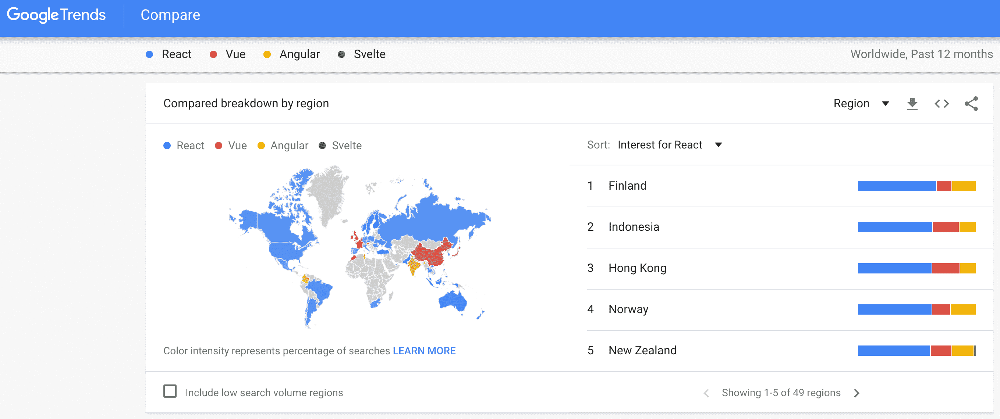
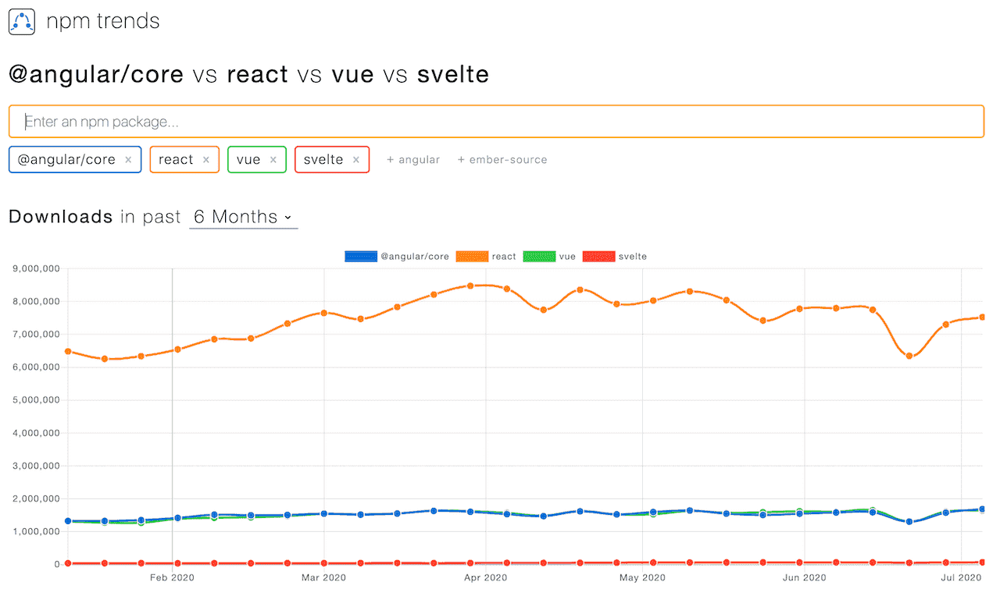

import { Notes, Head, Appear } from "mdx-deck"
import { CodeSurferLayout } from "code-surfer"
export { nightOwl as theme } from "code-surfer"
import { Bio, Meta } from '../../components'

<Head>
  <Meta title="Introduction to React" url="https://introduction-to-react-green.vercel.app" description="Introduction to React" />
</Head>

# Introduction to React

In-company Study Group @locol

---

## About me

<Bio />

---

## What is React :book:


- A JavaScript <em>library</em> for building user interfaces
  - React is not framework
  - The architecture using React is pluggable
- Learn Once, Write Anywhere
  - [Web](https://reactjs.org/), [Native Apps(Android, iOS)](https://reactnative.dev/), [VR](https://facebook.github.io/react-360/), [Infrastructure](https://adaptjs.org/)
- Rendering with Virtual DOM
- Syntax is JSX

---

## BTW, is React used?

---

<a href="https://trends.google.com/trends/explore?q=React,Vue,%2Fg%2F11c6w0ddw9,Svelte" target="_blank" rel="noopener">
  
</a>

---

<a href="https://www.npmtrends.com/react-vs-vue-vs-@angular/core-vs-svelte" target="_blank" rel="noopener">
  
</a>

---

## Virtual DOM

---


---


---


---


---

## JSX

---

<CodeSurferLayout>

```jsx subtitle="JSX is very simple"
import React from 'react'

export function Foo() {
  return <div>foo</div>
}
```

```jsx 3 subtitle="This is Foo Component, but Foo is just a function"
import React from 'react'

export function Foo() {
  return <div>foo</div>
}
```

```jsx 4 subtitle="just return html"
import React from 'react'

export function Foo() {
  return <div>foo</div>
}
```

</CodeSurferLayout>

---

## Conclusion

- Easy to maintain because it's easy to change the architecture using React
- React is used all over the world
- Lower rendering costs deu to differential updates of the Virtual DOM
- JSX is a simple function that returns HTML

---

## Thank you

